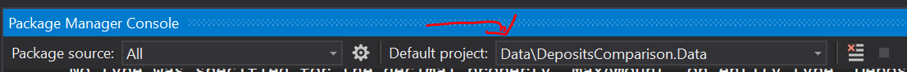
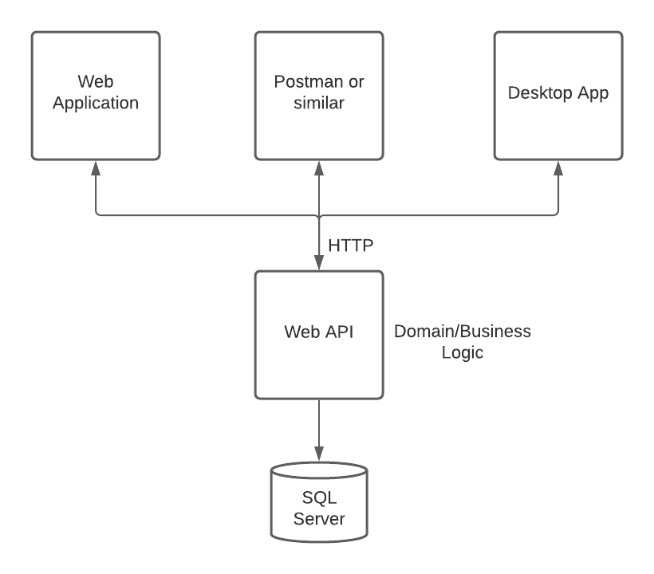

# DepositsComparisonSolution
Project for New Bulgarian University built using kind of microservices architecture and MS SQL as a database. The goal of the project is to have the domain logic in a single place that can be used by any other application.

The idea of the project is to provide a solution for listing and comparing bank products. The comparing functionality is limited to Deposits only. **The project is structured into 3 main components:**

## DepositsComparisonDomainLogicAPI
An [API](DepositsComparisonSolution/DepositsComparisonDomainLogicAPI) responsible for all the domain logic. It has 4 main controllers providing endpoints for different functionalities. 

|   Controller   | Functionality | Endpoints
| ---------------| --------------| -------
| Administration | It's supposed to be used only by admin applications. Provides functionality for creation of new deposit or bank. | CreateDeposit
| BankProducts   | Provides information about currently existing Bank products within the system | GetAllBankProducts
| Banks          | Provides information about currently existing Banks | GetAllBanks
| Deposits       | Provides information about currently existing Deposits | GetAllDeposits , GetFilteredDeposits

> **Note**: The API request should be sent to address that's with the following format:  {apiUrl}/{controllerName}/{endpointName} 

The API is the only application that has direct access to the database.

Initial information in the database is seeded from [Moitepari.bg](https://www.moitepari.bg).

**Technologies and libraries** : ASP.NET 5, Entity Framework 5 (Core), AngelSharp, AutoMapper

## DepositsComparer
A [MVC web application](DepositsComparisonSolution/DepositsComparer) responsible for visualisation of bank products, deposits and all other components to the users. It gives the customer the opportunity to check all products & deposits, to filter the deposits based on his preferences and to get a payment plan for a given deposit.

The web application is consuming data from the API. Due the the fact that the project by acceptance criteria is supposed to be operated/administrated from the desktop application, *the MVC web application doesn't contain any user management logic - login, register, roles and etc*

**Technologies and libraries** : ASP.NET 5, RestSharp

## DepositsCreator
A [WPF desktop application](DepositsComparisonSolution/DepositsCreator) responsible for the creation of new deposits and banks. It validates user input and send a request to the API in order to create the new entry. Project uses basic MVVM pattern.

**Technologies and libraries** : .NET 5, RestSharp

## Other projects inside solution

*  **[DepositsComparison.Data](DepositsComparisonSolution/DepositsComparison.Data)** - main project for database modifications and work. Contains configuration, repositories, seeding logic and the db context
* **[DepositsComparison.Data.Models](DepositsComparisonSolution/DepositsComparison.Data.Models)** - contains models used for the database entities. This project is used only by internal application (Data project and the API).
* **[DepositsComparison.Data.Public](DepositsComparisonSolution/DepositsComparison.Data.Public)** - contains public models used by all the application - API, Web, Desktop
* **[DepositsComparisonDomainLogic.Contracts](DepositsComparisonSolution/DepositsComparisonDomainLogic.Contracts)** - contains the contracts and public models required for communicating with the API

## Getting Started
These instructions will get you a copy of the project up and running on your local machine for development and testing purposes.

### Prerequisites
In order to be sure you can run the project, make sure you have the following frameworks installed on your PC:
* **NET 5** - should be installed with VisualStudio/Rider, double check it just in case
* **SQL Server 2019** - the project is built and tested on .NET 5 & EF Core 5 which, is using latest SQL Server version

It's good to have the following software products installed in order to be sure the project is running as expected:
* **VisualStudio 2019 / Rider 2020** - built and tested on both of those IDEs, the project should also be running on any newer version as long as it supports the above mentioned frameworks
* **SQL Server Management Studio (SSMS) / Azure Data Studio** - This one is not required at all, but if you want to check what happens in the database, it's good to have it. It's recommended to use latest version, the project has been tested on SSMS 2018 & Azure Data Studio 2020 and it's working fine.

### Installation

If you want to have **custom database name**, go to [appsettings.json](DepositsComparisonSolution/DepositsComparisonDomainLogicAPI/appsettings.json) file in API project and change **_THAT__** to whatever name you would like:
```
"ConnectionStrings": {
    "DefaultConnection": "Server=.;Database=THAT_;Trusted_Connection=True;MultipleActiveResultSets=true"
  }
```

Before initially running the project, go to [DepositsComparisonDomainLogicAPI](DepositsComparisonSolution/DepositsComparisonDomainLogicAPI) folder (the one containing PersonalWebsite.csproj file) and execute the following commands:

```
dotnet ef migrations add initialCreate
```
```
dotnet ef database update 
```
Those commands are required in order for the project to correctly build the database before running it.

> **Note** - There might be a problem here since the DB project [DepositsComparison.Data](DepositsComparisonSolution/DepositsComparison.Data) is a separate project from the [DepositsComparisonDomainLogicAPI](DepositsComparisonSolution/DepositsComparisonDomainLogicAPI). **In such case, follow the steps below**:
> * In VisualStudio, set startup project to DepositsComparisonDomainLogicAPI
> * Open Package Manager Console (type it in the search bar and it will show)
> * Change the **"Default project:"** to Data\DepositsComparison.Data  
> * Enter the following commands:
>   * Add-migration initialCreate
>   * Update-database 


### Running the project

In order to run the project, all the prerequisites from above should be prepared and also the installation process should be followed.
The project heavily depends on the API, so it's good to start with it, it's also responsible for building the database. 
There are 2 options:
1) Run projects 1 by 1, starting with [DepositsComparisonDomainLogicAPI](DepositsComparisonSolution/DepositsComparisonDomainLogicAPI) and then the web project ([DepositsComparer]((DepositsComparisonSolution/DepositsComparer))) and/or the desktop application ([DepositsCreator](DepositsComparisonSolution/DepositsCreator))
2) Run multiple projects at oonce - just make sure the API is included in those projects

> **Note** - The web and desktop applications are searching the API on a configurable address, so you have to be sure that it's properly configured. Here is example for localhost:
> * In **launchSettings.json** file (located in Properties folder, not published to Git) inside the [DepositsComparisonDomainLogicAPI](DepositsComparisonSolution/DepositsComparisonDomainLogicAPI) you can check on which ports does the API work. By default should be 5000/5001 in case it's being run via .NET/Core.
> * In the same file but in the [DepositsComparer](DepositsComparisonSolution/DepositsComparer) change the port to which the MVC web application runs. This will **prevent the 2 applications from occupying the same port**
> * In the [appsettings.json](DepositsComparisonSolution/DepositsComparer/appsettings.json) file inside the MVC web project there is a configuration called **APIConsumerSettings** and inside it is the URL to which the web applications searches for the API. *For the desktop application the value is currently hardcoded.*

## Business configurations

The API address, the configurations can be updated dynamically and it will affect the [DepositsComparer](DepositsComparisonSolution/DepositsComparer) web project

```js
"APIConsumerSettings": {
    "Url": "https://localhost:5001"
  }
```

## Project overview diagram


## Contribution
* **Ilian Ganchosov** - [Plotso](https://github.com/Plotso)
* **Kristiyan Knizharov** - [KristiyanKnizharov](https://github.com/KristiyanKnizharov)
* **Stefan Buldeev** - [Sbul99](https://github.com/sbul99)

## License
This project is licensed under the MIT License - see the [LICENSE.md](LICENSE.md) file for details
